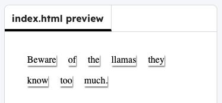

<h2 class="c-project-heading--task">Make a message</h2>

Think of your own mystery message and add it to the code.

## Step 1

Change the example code to display your message by putting one word in each ``. If your message is a different length, you will need to add or remove `` tags.

--- code ---
---
language: html
filename: index.html
line_numbers: true
line_number_start: 11
line_highlights: 12-19
---

  Beware
  of
  the
  llamas
  they
  know
  too
  much.

--- /code ---

## Now run your code

Click on the **Run** button and check that the words look like different cut-out pieces stuck onto the page.

