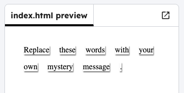

<h2 class="c-project-heading--task">Make a message</h2>

--- task ---

Think of your own mystery message and add it to the code. 

--- /task ---

--- task ---

Change the example code to display your message by putting one word in each ``. You will need to add or remove `` tags if your message is a different length. 

--- /task ---

--- code ---
---
language: html
line_numbers: true
line_number_start: 11
---

  Meet
  me
  on
  the
  corner
  at
  midnight.

--- /code ---

--- task ---

Click the **Run** button to test your code. See how the words have been styled to look like they’ve been stuck onto the page.

--- /task ---

