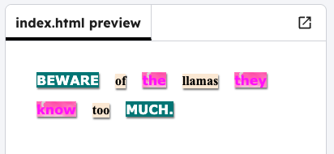

<h2 class="c-project-heading--task">Style the words</h2>

### Step 1

Add the `magazine1` **class** to style the first `` tag.

### Tip

A class in HTML/CSS is a name you give to something so you can change how it looks.

### Step 2

Try out different styles. For example, swap `magazine1` for `magazine2`, or `newspaper`.

--- code ---
---
language: html
filename: index.html
line_numbers: true
line_number_start: 11
line_highlights: 12-14
---

  Beware
  of
  the

--- /code ---

### Step 3

Click **Run** to see how the words change. Keep trying different style class names until you find one you like.

