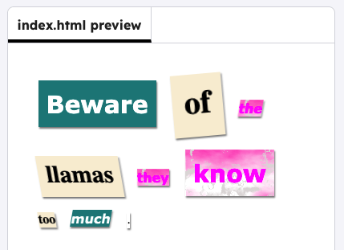

<h2 class="c-project-heading--task">Resize, rotate, and tilt words</h2>

Add classes to change the size and rotation of your words.

## Step 1

Choose a word and add the `big` class to the same `` tag.

## Step 2

Experiment with adding other classes to the `` tags in your message: 

+ `medium`, `big`, or `reallybig` change the size
+ `rotateleft` and `rotateright` rotate the words
+ `tiltleft` and `tiltright` distort the words

--- code ---
---
language: html
filename: index.html
line_numbers: true
line_number_start: 11
line_highlights: 12-14
---

  Beware
  of
  the

--- /code ---

## Step 3

Click on **Run** to see how your letter looks. Here is an example of how your letter could look:

## Now run your code

Click on **Run** and check that your letter now uses a mix of different sizes and rotations.
