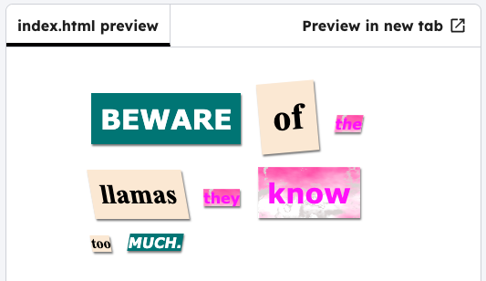

<h2 class="c-project-heading--task">Resize, rotate and tilt words</h2>

--- task ---

Add the `big` class to the same `` tag. 

--- /task ---

--- task ---

Experiment with adding other classes to the `` tags in your message: 

+ `medium`, `big` or `reallybig` change the size.
+ `rotateleft`, `rotateright` rotates.
+ `tiltleft`, `tiltright` distorts the words

--- /task ---

--- code ---
---
language: html
filename: index.html
line_numbers: true
line_number_start: 11
line_highlights: 12-14
---

  Beware
  of
  the

--- /code ---

--- task ---

Click **Run** to see how your letter looks. Here is an example of how your letter could look:

--- /task ---

