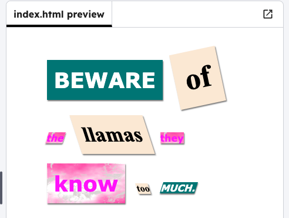

<h2 class="c-project-heading--task">Edit the CSS</h2>

### Step 1

Edit the CSS properties in **style.css** to change the size and slant of your words.

### Step 2

Click on the file icon, and then the **style.css** file. This will open a new tab.

### Step 3

In the **style.css** file, change how your words look by editing the properties. You can edit the `font-size`, or the `rotate` and `tilt` values. 

--- code ---
---
language: css
filename: style.css
line_numbers: true
line_number_start: 50
line_highlights: 53,58,63,69,73,77,81
---

.medium {
  font-size: 24px;
  padding: 10px;
}

.big {
  font-size: 36px;
  padding: 12px;
}

.reallybig {
  font-size: 52px;
  padding: 18px;
}

.rotateleft {
  transform: rotate(-12deg);
}

.rotateright {
  transform: rotate(12deg);
}

.tiltleft {
  transform: skewX(18deg);
}

.tiltright {
  transform: skewX(-18deg);
}

--- /code ---

### Step 4
Click **Run** to see the changes. Experiment by changing the numbers to create different effects.

