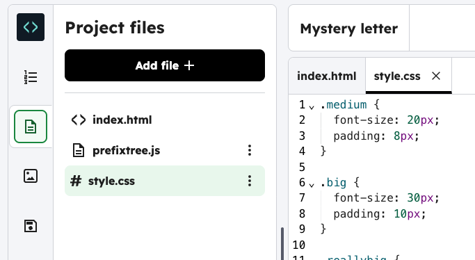

<h2 class="c-project-heading--task">Edit the CSS</h2>

Edit the CSS properties in **style.css** to change the size and slant of your words.

## Step 1

Click on the **Project files** icon, and then the **style.css** file. This will open a new tab.

## Step 2

In the **style.css** file, edit the properties to change how your words look. You can edit the `font-size`, or the `rotate` and `tilt` values. 

--- code ---
---
language: css
filename: style.css
line_numbers: true
line_number_start: 1
line_highlights:
---

.medium {
  font-size: 24px;
  padding: 10px;
}

.big {
  font-size: 36px;
  padding: 12px;
}

.reallybig {
  font-size: 52px;
  padding: 18px;
}

.rotateleft {
  transform: rotate(-12deg);
}

.rotateright {
  transform: rotate(12deg);
}

.tiltleft {
  transform: skewX(18deg);
}

.tiltright {
  transform: skewX(-18deg);
}

--- /code ---

## Step 3

Click on **Run** to see the changes. Experiment by changing the numbers to create different effects.

## Now run your code

Click on **Run** and check that some words are now rotated or tilted differently.
