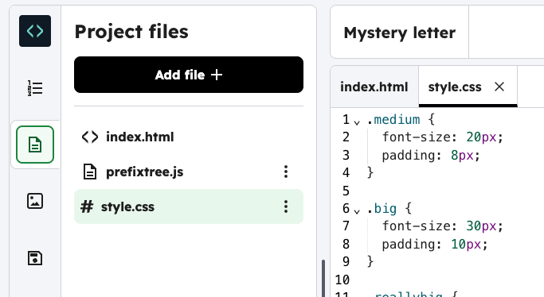
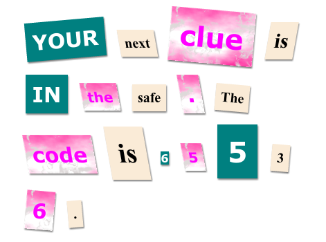

<h2 class="c-project-heading--task">Edit the CSS</h2>

--- task ---

Rotate and tilt your words in the **style.css** file.

--- /task ---

--- task ---

Click on the file icon, and then the **style.css** file. This will open a new tab.

--- /task ---

--- task ---

In the **style.css** file, change how your words look by editing the properties. You can edit the `font-size`, or the `rotate` and `tilt` values. 

--- /task ---

--- code ---
---
language: css
filename: style.css
line_numbers: true
line_number_start: 50

---
.medium {
  font-size: 20px;
  padding: 8px;
}

.big {
  font-size: 30px;
  padding: 10px;
}

.reallybig {
  font-size: 40px;
  padding: 15px;
}

.rotateleft {
  transform: rotate(-5deg);
}

.rotateright {
  transform: rotate(5deg);
}

.tiltleft {
  transform: tiltX(10deg);
}

.tiltright {
  transform: tiltX(-10deg);
}

--- /code ---

--- task ---
Click **Run** to see the changes. Experiment by changing the numbers to create different effects.

--- /task ---

