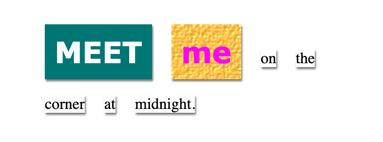

<h2 class="c-project-heading--task">STEP TITLE</h2>

--- task ---

BRIEF SUMMARY OF STEP - one line

--- /task ---

--- task ---

Change the `background-image` for `magazine2` to `canvas.png`. 

--- code ---
---
language: css
line_numbers: true
line_number_start: 28
line_highlights: 29
---

.magazine2 {
  background-image: url('canvas.png');
  color: fuchsia;
  font-family: Verdana;
  font-weight: 900;
}

--- /code ---

--- /task ---

--- task ---

Click **Run** to see what happens. 

(If you prefer `pink-pattern.png` you can change it back.)

--- /task ---

