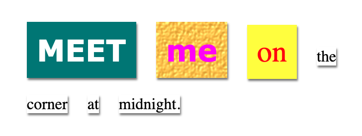

<h2 class="c-project-heading--task">STEP TITLE</h2>

--- task ---

BRIEF SUMMARY OF STEP - one line

--- /task ---

--- task ---

Switch back to `index.html`. Apply the comic style to one of the `` tags.

--- code ---
---
language: html
line_numbers: true
line_number_start: 11
line_highlights: 14

---

  Meet
  me
  on

--- /code ---

--- /task ---

--- task ---

Click **Run** to see what your new style looks like.

--- /task ---
